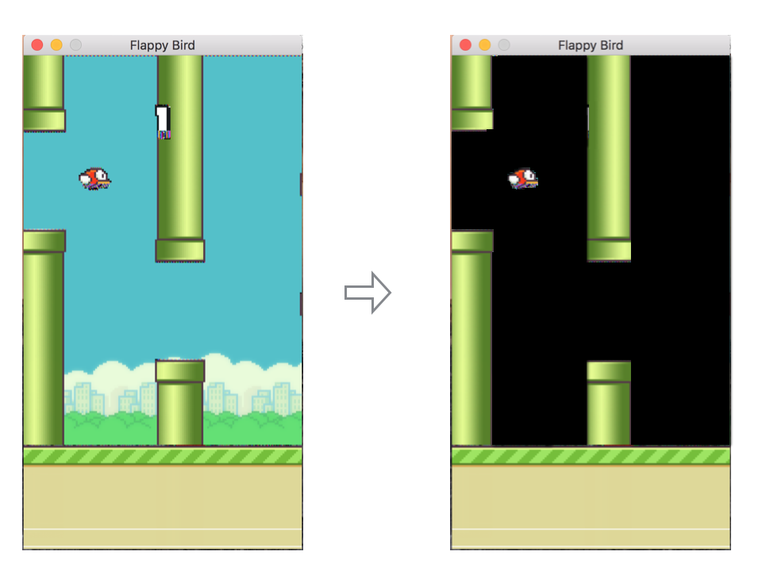

# 从零看懂本项目的「对抗神经网络」—— Flappy Bird DQN 小白入门

> 本文面向**完全没有强化学习基础**的读者。你只需要知道"神经网络是一个能拟合函数的黑盒"，其余从头讲起。
>
> 本文所有代码引用都标注了**文件名和行号**，并已对照当前代码逐条核对过。

---

## 0. 先澄清一件事：这里的「对抗」不是 GAN ⚠️

这是全文最重要的一节。如果你是搜索「对抗神经网络」找到这里的，请先读完这 10 行，否则后面全会误解。

**「对抗」这个词在中文 AI 语境里至少有三种完全不同的含义：**

| 说法 | 英文 | 是什么 | 本项目有吗 |
|---|---|---|---|
| 生成对抗网络 | GAN | 生成器造假、判别器打假，两个网络**真的在做零和博弈** | ❌ **没有** |
| 对抗样本 / 对抗攻击 | Adversarial examples | 给图片加人眼看不见的噪声，骗过分类器 | ❌ **没有** |
| 本项目说的「对抗」 | —— | **主网络 `q_network` 与目标网络 `target_network` 的关系** | ✅ 就是这个 |

在整个仓库里，「对抗」二字**只出现在 `Adversarial_Learning_Theory_Analysis.md` 一个文件**中；全仓库 grep `generator` / `discriminator` / `GAN` / `生成器` / `判别器`，命中数为 **0**。

那份文档在 `Adversarial_Learning_Theory_Analysis.md:1136-1140` 把两个普通的 DQN 网络称作「对抗网络初始化」：

```python
# 对抗网络初始化
self.q_network = FixedOptimizedDQN(actions).to(device)       # 主网络 θ
self.target_network = FixedOptimizedDQN(actions).to(device)  # 目标网络 θ⁻
```

并在 `:1179-1183` 进一步把 DQN 套成了 GAN 式的鞍点问题：

$$\min_\theta \max_{\theta^-} \mathbb{E}[L(Q_\theta(s,a),\ r + \gamma Q_{\theta^-}(\cdot))]$$

**这个式子是不成立的。** θ⁻（目标网络）从来不做梯度上升，它只是 θ 的一份**周期性拷贝**：

```python
# deep_Q_dueling_DQN.py:444-445
if self.decision_step % self.target_update_freq == 0:
    self.target_network.load_state_dict(self.q_network.state_dict())
```

`load_state_dict` 就是"复制粘贴"，没有任何 `max` 优化在发生。那份文档自己在 `:177` 也承认了：「目标网络**不直接影响训练**，只提供稳定的学习目标」——这与它自己的鞍点框架直接矛盾。

**结论**：把本项目的双网络机制叫「对抗」，是一个**比喻**（像"严师与考官"），不是数学事实。理解它的正确方式是"**移动靶问题**"，见第 5 节。本文后面提到「对抗」时，一律加引号，指的就是这层比喻含义。

---

## 1. 一句话说清这个项目在干什么


```
      屏幕像素  ──→  神经网络  ──→  两个数字  ──→  选大的那个
    (小鸟和管道)                  Q(不跳), Q(跳)
                                       ↑
                                    这两个数字
                                  是"预期总收益"
```

* **智能体（agent）**：那只鸟。它每隔几帧要做一个二选一的决定：**跳** 还是 **不跳**。
* **环境（environment）**：游戏本身。它接收动作，返回新画面、一个**奖励数字**、以及"是否死了"。
* **奖励（reward）**：过一根管道 `+1`，撞死 `-1`。就这么简单。
  见 [game/flappy_env.py:60-63](game/flappy_env.py#L60-L63)。
* **目标**：让鸟自己学会一套策略，使**未来累计奖励**最大。

没有人告诉鸟"看到管道要跳"。它只知道分数，其余全靠试错。

---

## 2. 环境到底给了什么？—— `step()` 的契约

仓库里之前没有任何文档讲过这一层，但它是理解一切的基础。

```python
# game/flappy_env.py
obs, reward, done, info = env.step(action)
```

| 返回值 | 类型 | 含义 |
|---|---|---|
| `obs` | `(288, 512, 3)` uint8 | 这一帧的原始画面（注意是 width-major，即转置的） |
| `reward` | float | 这一帧拿到的奖励 |
| `done` | bool | 撞了没有 |
| `info` | dict | `score`（已过管道数）、`potential`、`frames`、`scored` |

**一条重要契约**：`step()` **绝不会自己重置游戏**。死了以后必须显式调用 `env.reset()`，否则直接抛异常。

这看起来是小事，但旧环境正是栽在这里 —— 见第 9 节的坑 #4。

---

## 3. 神经网络"看"到的不是彩色画面

原始画面是 288×512 的彩图，太大且信息冗余。真正喂给网络的是这样处理过的：



```python
# train_flappy_dqn.py: preprocess()
gray   = cv2.cvtColor(obs, cv2.COLOR_BGR2GRAY)                       # 1. 转灰度
small  = cv2.resize(gray, (80, 80), interpolation=cv2.INTER_AREA)    # 2. 缩到 80x80
_, binary = cv2.threshold(small, 1, 255, cv2.THRESH_BINARY)          # 3. 二值化：非黑即白
```

三步之后，一帧变成 **80×80 的黑白图**，每个像素只有 0 或 255 两种值。

> 💡 为什么 `INTER_AREA` 要在二值化**之前**做？因为管道很细、小鸟很小，先二值化再缩放会把它们抹掉。

### 3.1 为什么要堆 4 帧？

**一张静止的图片看不出速度。**

```
只看这一帧：            堆 4 帧一起看：
   🐦                    🐦(t-3) 🐦(t-2) 🐦(t-1) 🐦(t)
                          ↑ 从这个序列能看出鸟在往下掉，还是刚跳起来
鸟在上升还是下降？
完全无法判断
```

小鸟的垂直速度 `playerVelY` 是决定它下一刻位置的关键变量，但它**不在画面里**。唯一的办法是让网络看连续几帧，自己从位置变化里推断速度。

所以网络的输入是 **`(4, 80, 80)`** —— 4 张叠在一起的黑白图。

```python
# 回合开始：4 帧全用同一张（还没有历史）
stack = np.repeat(frame[None], 4, axis=0)

# 之后每步：新帧插到最前，最老的一帧挤出去
stack = np.concatenate([new_frame[None], stack[:3]], axis=0)
```

---

## 4. Q 值：这个项目里最核心的一个概念

**Q(状态, 动作) = 「在这个状态下做这个动作，之后一直好好玩，预计总共能拿多少分」**

举个具体的：

```
状态：鸟在管道缝隙上方一点，正在下落
  Q(不跳) = 2.1     ← 继续下落刚好穿过缝隙，之后还能过好几根管道
  Q(跳)   = -0.8    ← 一跳就撞到上管道，马上死
→ 选 Q 大的：不跳
```

网络的全部工作就是：**看一眼 4 帧画面，输出这两个数字**。

### 4.1 未来的分要打折：γ（gamma）

"现在的 1 分" 比 "10 步之后的 1 分" 更值钱（因为中间可能死掉）。所以：

$$Q = r_0 + \gamma r_1 + \gamma^2 r_2 + \gamma^3 r_3 + \cdots$$

本项目 `gamma = 0.99`（[train_flappy_dqn.py](train_flappy_dqn.py) 的 `CONFIG`）。

**这个折扣带来一个很实用的换算**：本项目管道间隔约 7.2 次决策，`0.99^7.2 ≈ 0.93`，于是在**低分段**：

> **Q_mean ≈ 0.9 × 已过管道数**

这就是一把**免费的尺子**：训练早期如果网络报告 Q≈2.0，那它认为自己能过约 2 根管道。拿它和实际过管道数一比，立刻知道价值函数有没有在说谎。旧管线没有这把尺子，因为它的奖励是 `+20 / -2`，Q 值范围是 `[-2, 250]`，看不出所以然。

⚠️ **但这条规律有上限**。折扣求和是收敛的：

$$Q_{\max} = \frac{\gamma^{12.5}}{1-\gamma^{7.2}} \approx \frac{0.882}{0.0699} \approx 12.6$$

（12.5 = 管道从生成到得分的决策数，7.2 = 管道间隔的决策数）

也就是说，**一个永远不死的策略，它的 Q 也只会趋向 12.6，而不是趋向"过了几百根管道"**。所以：

* 低分段（0~10 根）：`Q ≈ 0.9 × 管道数`，可以用来查高估/低估
* 高分段：Q 饱和在 12.6 附近，此时该看的是**实际过管道数**，不是 Q

### 4.2 怎么训练？—— Bellman 方程

Q 值不能直接监督（没人知道"正确答案"是多少）。办法是让它**自己和自己对齐**：

$$\underbrace{Q(s,a)}_{\text{现在的估计}} \;\longleftarrow\; \underbrace{r + \gamma \max_{a'} Q(s',a')}_{\text{学习目标：真实奖励 + 下一步的估计}}$$

翻译成人话：

> "我在这一步**实实在在**拿到了 `r` 分，加上我对**下一个状态**的估计 —— 这两个加起来，应该等于我对**当前状态**的估计。如果不相等，就是我估错了，改。"

差值 `r + γ max Q(s',a') - Q(s,a)` 叫 **TD 误差（时序差分误差）**，它就是训练的损失。

---

## 5. 「对抗」的真相：为什么必须有两个网络

现在回到第 0 节的问题。

### 5.1 移动靶问题

看上面那个更新式：等号右边有 `Q(s')`，等号左边有 `Q(s,a)`，**它们是同一个网络**。

于是每更新一次参数，"学习目标"本身也跟着变了：

```
你在射击训练。
靶子固定 → 你能瞄准、修正、命中。
靶子绑在你自己身上 → 你每动一下，靶子跟着动 → 永远打不中。
```

这就是**移动靶（moving target）问题**。DQN 的解法：

> 复制一份网络，冻结住，**专门用来算目标**。每隔一段时间才更新这份拷贝。

* **主网络 `online`**：每一步都在学，参数一直变
* **目标网络 `target`**：被冻住，只负责提供"靶子"，隔一阵才同步一次

```python
# train_flappy_dqn.py, Agent.__init__
self.target.load_state_dict(self.online.state_dict())
self.target.eval()
for p in self.target.parameters():
    p.requires_grad_(False)      # 目标网络永远不参与梯度
```

这就是本项目所谓的「双网络对抗」。**它不是零和博弈，是"一个在学、一个当参照物"**。用"严师与考官"打比方可以，但别当成 GAN。

### 5.2 同步频率：一个被严重低估的超参数

这是本项目栽过最大跟头的地方，值得单独讲。

**关键事实**：目标网络被冻住的这段时间里，学习目标是**固定**的。把它拟合到收敛，相当于完整地做了**一次** Bellman 更新 —— 也就是说，奖励信息只能**向前传播一步**。

而在 Flappy Bird 里：

```
管道生成 ──────── 50 帧 ────────→ 鸟穿过它拿到 +1
             (帧跳过 4 之后 = 12.5 次决策)
```

要让"过管道得 +1"这个信息，一路倒推回"管道刚出现时该怎么飞"，**至少需要约 13 次目标网络同步**。

旧配置：

```python
# deep_Q_dueling_DQN.py:258
self.target_update_freq = 125000     # 每 12.5 万步同步一次
```

实测结果：**12.5 小时的训练，一共只同步了 11 次。**

11 次 Bellman 回传，意味着价值信息只能传播 11 步 —— 刚好够看到"眼前这根管道"，再往前一点就是黑的。这就精确解释了为什么旧管线的成绩死死卡在 **1.2 根管道**。

新配置改成**每 1000 次梯度步**同步一次。下面是新脚本冒烟测试的实测图（第 2 张子图），红色竖线就是每次同步：

```
Q 值随梯度步的变化（红线 = 目标网络同步）
2.5 ┤                                              ╭──
2.0 ┤                                      ╭───╯
1.5 ┤                             ╭────╯
1.0 ┤                    ╭────╯
0.5 ┤          ╭─────╯
0.0 ┼──╯
    └─┬────┬────┬────┬────┬────┬────┬────┬────┬────
      0   1k   2k   3k   4k   5k   6k   7k  梯度步
```

Q 值呈**阶梯状**上升，每一级正好对应一次同步。实测数据：**24 次同步中有 23 次让 Q 均值上跳，平均每次 +0.096**。

> 🎯 **这张图就是「价值沿时间反向传播」的可视化。** 旧管线永远画不出这张图 —— 它的日志里根本没记录 Q 值和同步时刻。

### 5.3 Double DQN：选动作的和打分的要分开

还有一个细节。原始的 `max_{a'} Q(s',a')` 有个毛病：**它同时用同一个网络"挑最大的"和"报出这个最大值"**，而网络的估计总有噪声，挑最大值这个操作会**系统性地挑中被高估的那个** —— 于是 Q 值越滚越高。

Double DQN 的修正：**让主网络挑动作，让目标网络打分**。

```python
# train_flappy_dqn.py, Agent.learn()
with torch.no_grad():
    a_star = self.online(s1).argmax(1, keepdim=True)   # 主网络：我觉得这个动作最好
    q_next = self.target(s1).gather(1, a_star)         # 目标网络：让我来给它打分
    y = r.unsqueeze(1) + gamma * q_next * (~d).unsqueeze(1)
```

注意最后那个 `(~d)`：**如果这一步死了，就没有"下一步"了**，未来价值必须归零。漏掉这个掩码是 DQN 最常见的致命 bug 之一。

---

## 6. 经验回放：为什么不能拿刚发生的事直接训练

如果按游戏发生的顺序一帧帧训练，会有两个问题：

1. **样本高度相关**。连续几帧几乎一模一样，等于把同一个样本重复喂了很多遍，梯度方向严重偏斜。
2. **学了就忘**。用过一次就丢掉，罕见但重要的经历（比如好不容易过了一根管道）只被学习一次。

解法：把每一条经历 `(状态, 动作, 奖励, 下一状态, 是否结束)` 存进一个大池子，训练时**随机抽一批**：

```python
# train_flappy_dqn.py, ReplayBuffer.sample()
idx = np.random.randint(0, self.size, size=n)     # 随机抽，打散时间相关性
```

本项目池子存 20 万条。有个存储小技巧：连续两个状态共享 3 帧，所以只需存 `state`(4帧) + `next_frame`(1帧)，采样时再拼出 `next_state`：

```python
s1 = np.concatenate([self.next_frames[idx], s[:, :3]], axis=1)
```

再配合 **uint8** 存储（画面已经二值化，只有 0/255，根本不需要 float32），内存从旧版的 **20 GB** 降到 **6.4 GB**。

---

## 7. ε-greedy：探索与利用

训练初期网络啥也不会，如果一直听它的，鸟会一头撞死然后永远学不到别的。所以要**强制随机试探**：

```python
if random.random() < epsilon:
    action = 随机动作           # 探索
else:
    action = 网络认为最好的动作  # 利用
```

ε 从 1.0（全随机）慢慢降到 0.01（几乎全听网络的）。

### 7.1 一个反直觉的细节：随机动作不该是 50/50

"随机"通常意味着两个动作各 50%。但在 Flappy Bird 里这是**错的**：

```
一次扇翅：速度瞬间变成 -5（向上）
重力：每帧 +0.5

单次扇翅后，净位移在 T ≈ 19 帧（约 5 次决策）时归零
→ 想"悬停"，扇翅频率应该是 1/5 ≈ 0.2
```

如果按 50% 随机扇翅，鸟会被**死死顶在天花板上**，整局都在贴着顶飞 —— 收集到的经验毫无价值。这正是旧管线 warmup 阶段数据无用的原因。

```python
# train_flappy_dqn.py: sample_random_action()
return 1 if random.random() < 0.2 else 0
```

**实测效果惊人**：p_flap=0.2 的**纯随机策略**（完全没有网络参与）平均能过 **0.63 根管道**，最高过 6 根。
而旧管线训练 10 万局 / 13 小时之后是 **约 1.3 根**。

> ⚠️ 这个对比很说明问题：**13 小时的训练，只买到了相对随机基线 2 倍的提升。**

---

## 8. 怎么看出模型到底在不在学？

这是本文最实用的一节。新管线把所有指标写进 CSV（`runs/<时间戳>/`），用 `plot_training_v2.py` 画出 6 张诊断图。

```bash
python plot_training_v2.py runs/20260811_221138
```

### 8.1 健康 vs 有病对照表

| 指标 | 健康的样子 | 有病的样子 | 说明什么 |
|---|---|---|---|
| **初始 Q** | \|q_mean\| < 0.05 | 一开始就是几十 | 输出层初始化不对 |
| **Q vs 管道数**（低分段） | `q_mean ≈ 0.9 × 管道数` | Q 远高于管道数 | 价值高估（Double DQN 没生效） |
| **Q 曲线形状** | 阶梯状，每级对应一次同步 | 平的 / 疯涨 | 目标网络同步太少 / 发散 |
| **loss** | 每次同步后小幅上跳再回落 | 完全平坦 | 目标没在动，或学习率太小 |
| **loss 量级** | `1e-2 ~ 1e-1` 早期 | `1e-6` 级别 | 奖励信号根本没进梯度 |
| **grad_norm** | 明显低于裁剪阈值 | 长期顶在阈值上 | 裁剪过紧，Adam 退化成归一化 SGD |
| **贪婪评测 vs 训练分** | 评测分 ≥ 训练分 | 评测分远低于训练分 | 探索噪声掩盖了策略退化 |
| **\|Q(跳)−Q(不跳)\|** | 明显大于 0 | 接近 0 | 网络根本分不清两个动作 |

### 8.2 一次真实的冒烟测试记录

下面是新管线在**纯 CPU** 上跑 1500 局（约 6 分钟）的实测数据，可作为对照基准：

```
配置：--smoke（warmup=5000, target_sync=300 梯度步, buffer=40000）
命令：python train_flappy_dqn.py --smoke --allow-cpu --episodes 1500 --buffer 40000

局数 1500 | 决策 28035 | 梯度步 11517 | 目标网络同步 38 次

判据 1  初始 q_mean          = -0.028        ✅ |q| < 0.05
判据 3  同步后 loss 上跳      0.0270 → 0.0369 ✅ +36%，各周期方向一致
判据 4  q_mean 轨迹          -0.03 → 3.91    ✅ 与管道数同步上升
        24 次同步中 23 次让 q_mean 上跳，平均每次 +0.096
        （这就是"每次同步 = 一次 Bellman 回传"的直接测量）

训练时 recent100_pipes：0.63（随机基线）→ 2.63（此时 ε 还有 0.45）

贪婪评测（ε=0）：
  上限  400 次决策，20 局 →  20/20 局撑到上限仍存活，每局  53 根管道
  上限 3000 次决策， 5 局 →   5/5 局撑到上限仍存活，每局 406 根管道
  不设上限（只有撞死才停），12 局：
        平均 4054 根管道，中位数 3352，最高 11040
        平均每局 29908 次决策（约 12 万帧）
```

对照旧管线：**10 万局 / 13 小时 / GPU，近百局均分约 1.3 根管道。**

也就是说：**6 分钟的 CPU 训练，换来约 3000 倍的成绩提升。**

> 🔍 这里有一个很值得玩味的观察：这个 checkpoint 平均能过 **4054 根管道**，
> 但它报告的 `mean max-Q` 只有 **2.81** —— 远低于 12.6 的理论上限。
>
> **策略的好坏和价值估计的准确度是两回事。** 这个网络已经知道"该怎么飞"
> （策略对了），但还不知道"这么飞到底值多少分"（价值还没传播开，
> 因为只做了 24 次目标网络同步）。继续训练下去，Q 会慢慢爬向 12.6，
> 而管道数早就已经很高了。
>
> 所以**评价一个智能体，要看它实际的表现，而不是它自己报告的 Q 值**。

> 📌 关于那个"53 根、标准差 0"：这不是巧合。撑满 400 次决策 = 1600 帧，
> 管道每 28.8 帧来一根 → **只要不死，管道数就由时间唯一决定**。
> 所以这个数字说明的是"20 局全都没死"，而不是"真实水平就是 53 根"。
> 上限放开到不设限之后，真实成绩是 4054 根（标准差 3506，方差很大）。
>
> **报告指标时一定要交代上限是多少、有几局撞到了上限**，否则数字会骗人 ——
> 一个被上限压平的均值，看起来比真实水平低得多，而且标准差会假性归零。

> 💡 注意判据 3 的幅度。计划里原本预期同步后 loss 会有 3–10 倍的尖峰，实测只有 1.36 倍。
> **这不是不达标，恰恰相反**：3–10 倍意味着目标网络在两次同步之间漂移得非常远
> （同步太稀疏）。每 300 梯度步就同步一次时，目标漂移有限，**温和的锯齿才是健康信号**。

### 8.3 举个真实例子：旧管线的 loss 为什么是铁证

旧管线的日志里，minibatch loss 长期是 **0.002 ~ 0.007**。

乍看"loss 很小 = 学得很好"，其实完全相反。算一笔账：

```
一根管道值 +20 分
但"过管道"这个事件，在经验池里只占 0.2%
batch = 128 时，平均每批只有 0.26 条这样的样本
→ 99.8% 的样本是"没事发生"的易预测样本，误差被压到接近 0
→ 平均下来 loss = 0.003
→ 罕见但唯一重要的 +20 信号，被彻底淹没了
```

**"loss 小"在强化学习里根本不是好消息，要结合奖励尺度一起看。** 换算到新的 ±1 尺度，旧的 0.002 相当于 `5e-6` —— 比一个正常学习中的网络低 4 个数量级。

---

## 9. 本项目真实踩过的 12 个坑 🕳️

这一节是本文最有价值的部分：**这些不是教科书上的假想错误，是这个仓库里真实发生过、并且让 4 轮共几十小时训练全部报废的 bug。**

---

### 坑 #1：网络从不调用 `eval()` —— 最致命的一个

**现象**：训练 13 小时，成绩纹丝不动。

**位置**：[deep_Q_dueling_DQN.py:320-344](deep_Q_dueling_DQN.py#L320-L344)（`select_action` 里只有 `torch.no_grad()`，没有 `.eval()`）

**为什么致命**：网络里有 `nn.Dropout(0.3)`（`:134`）和三个 `BatchNorm2d`（`:122-124`）。

1. **Dropout 让"贪婪"变成随机**：每次选动作，随机丢掉 30% 的特征。两个动作的 Q 值本来差距就小，argmax 频繁翻转 —— 你以为在执行最优策略，实际在掷骰子。
2. **目标网络的 BatchNorm 是真正的杀手**：目标网络也一直处于 train 模式，它的 BatchNorm 用**当前这一批 128 个样本**的统计量做归一化。这意味着：

   > 同一个状态 `s'`，因为和它一批的另外 127 个样本不同，算出来的 `Q⁻(s',a)` 就不同。

   **学习目标变成了一个依赖批次组成的随机变量。** Bellman 算子不再是固定算子，**根本不存在不动点**。"冻结目标网络以保证稳定"这个前提被彻底破坏了。

**怎么修**：不是"记得调用 `.eval()`"，而是**直接删掉 BatchNorm 和 Dropout**。删掉之后 `train()/eval()` 变成空操作，bug 在结构上不可能复发。

再加一行自检，当初就能抓到：

```python
# train_flappy_dqn.py, Agent.assert_deterministic_act()
assert torch.allclose(net(dummy), net(dummy)), "网络在推理时是随机的"
```

---

### 坑 #2：目标网络 12.5 小时只同步 11 次

见 5.2 节。`target_update_freq = 125000`（[deep_Q_dueling_DQN.py:258](deep_Q_dueling_DQN.py#L258)）。

**教训**：目标网络同步频率的正确单位是**梯度步**，不是环境步；而且它直接决定了价值能传播多远。

---

### 坑 #3：帧跳过导致状态、动作、奖励三者全部错位

**位置**：[continue_training.py:758-778](continue_training.py#L758-L778)

```python
758  if agent.step % agent.training_freq == 0:      # ← 自增之前判断
759      action_index = agent.select_action(s_t)
765  else: a_t = np.array([1, 0])                   # 非决策帧强制不跳
773  agent.step += 1                                # ← 自增夹在中间！
776  if agent.step % agent.training_freq == 0:      # ← 自增之后判断
778      agent.store_transition(s_t, action_index, r_t, s_t1, terminal)
```

两个 `% 4` 判断分别在自增前后求值，**永远不会同时成立**：动作在 `step ≡ 0` 时选，经验在 `step ≡ 3` 时存。后果三条，每条都足以致命：

1. **动作标签全是假的**：存进去的是"第 0 帧选的动作"，而第 3 帧实际执行的是硬编码的**不跳**。网络在用"不跳"产生的数据去学"跳"的 Q 值。
2. **75% 的奖励被丢弃**：`+20` 落在哪一帧是随机的，四帧里只有一帧会被存。
3. **75% 的 terminal 被丢弃**：鸟死在非决策帧时，`done=True` 从未进入经验池 —— 网络学不到"撞死是坏事"。

而且 `s_t` 在这中间已经被 `s_t = s_t1` 覆盖了 3 次，所以存进去的其实是 `(s_{t+3}, a_t, r_{t+3}, s_{t+4})`。

**怎么修**：把帧跳过封装成一个函数，主循环里**永远不出现 `% k`**：

```python
# train_flappy_dqn.py: skip_step()
r_raw = 0.0
for _ in range(FRAME_SKIP):
    obs, r, done, info = env.step(action)   # 同一个动作重复 k 帧
    r_raw += r                              # 每一帧的奖励都累加，一分不丢
    if done:
        break                               # 死了就立刻停
```

---

### 坑 #4：terminal 那一帧返回的是下一局的画面

**位置**：[game/wrapped_flappy_bird_fast.py:154](game/wrapped_flappy_bird_fast.py#L154)

```python
if isCrash:
    terminal = True
    self.__init__()          # ← 在绘制之前就把游戏重置了！
    reward = -2
# ... 下面才开始画精灵 ...
image_data = pygame.surfarray.array3d(...)   # 画的是重置后的新局面
```

于是"崩溃那一帧"的画面，其实是**下一局的第一帧**。

雪上加霜的是，训练循环里 `s_t = s_t1` 是无条件执行的（`:785`），且不重置帧栈。于是新回合的**前 3 次决策**，帧栈里都混着上一局的画面，还以 `done=False` 存进经验池。每局约 14 次决策，**约 23% 的经验是物理上不可能存在的状态**。

而"帧差分"正是网络推断速度的唯一途径 —— 这些样本里的"速度"完全是垃圾。

**怎么修**：环境里 `step()` 绝不内部 reset；训练循环里回合结束后显式重置帧栈：

```python
if done:
    frame = preprocess(env.reset())
    stack = np.repeat(frame[None], 4, axis=0)   # 从头堆，不带任何历史
```

---

### 坑 #5：优先经验回放退化成"只采最新的样本"

**位置**：[deep_Q_dueling_DQN.py:57, 71, 97-100](deep_Q_dueling_DQN.py#L97-L100)

```python
:97   priority = (abs(td_error) + 1e-6) ** self.alpha    # α 在写入时施加了一次
:71   probs = valid_priorities ** self.alpha             # α 在读取时又施加了一次！
:100  self.max_priority = max(self.max_priority, priority)  # 单调不降，永不衰减
```

两个 bug：

1. **α 被施加了两次**，实际指数是 `α² = 0.64` 而不是配置的 0.8 —— 调参旋钮的行为和标签对不上。
2. **`max_priority` 只增不减**。一旦出现过一个 `+20` 的样本，它就固定在 `20^0.8 ≈ 11` 再也不降。之后**每一条新样本**都被打上这个最高优先级；而被采样过的老样本优先级掉到 `0.01^0.8 ≈ 0.025`。

   结果：**新样本被采中的概率是老样本的约 276 倍**。经验回放变成了"只从最近的一小段窗口里采样" —— 而**打散时间相关性正是经验回放存在的全部意义**，它被自己抵消了。

**怎么修**：先退回**均匀采样**。PER 在这里想解决的"管道样本稀疏"问题，已经被帧跳过（管道事件占比 0.2%→0.8%）和 1000 倍的 Bellman 回传次数解决了。等基础版本跑通了再考虑用 sum-tree 正确实现 PER。

---

### 坑 #6：势能塑形与当前动作完全无关

**位置**：[game/wrapped_flappy_bird_fast.py:83](game/wrapped_flappy_bird_fast.py#L83)

塑形奖励在 `frame_step` 的**最开头**计算 —— 那时候动作还没施加，物理还没更新。所以它算出来的是

$$\gamma\Phi(s_t) - \Phi(s_{t-1})$$

而不是应该的 `γΦ(s_{t+1}) − Φ(s_t)`。**它描述的是上一步的事，跟这一步选了什么动作毫无关系。**

塑形奖励存在的全部意义就是给出一个能区分"跳"和"不跳"的稠密信号，而它恰恰做不到这一点。更糟的是，它的量级（±0.01）是基础生存奖励（1e-4）的 **100 倍**，是每帧的主导信号 —— 一个纯粹错位的主导信号。

另外 `:213` 的截断 `max(-0.01, min(0.01, ...))` 破坏了势能塑形的**望远镜求和**性质，也就破坏了 Ng et al. 1999 的**策略不变性**保证 —— 塑形后的最优策略不再等于真正的最优策略，它可能更愿意"停在缝隙中心不动"而不是往前飞。

**怎么修**：在物理更新**之后**计算，终止态取 `Φ = 0`，**不截断**（量级靠 Φ 本身的归一化控制）。新实现有单测证明望远镜求和精确成立：

```
[1] OK  telescope_err=5.13e-16
```

---

### 坑 #7：`reward = -2` 用的是赋值，不是累加

**位置**：[game/wrapped_flappy_bird_fast.py:113, 156](game/wrapped_flappy_bird_fast.py#L113)

```python
:113   reward = 20    # 过管道
:156   reward = -2    # 撞死
```

两个都是**赋值**。同一帧里既过了管道又撞死时，`+20` 被 `-2` 整个覆盖 —— 而"擦着管道边缘惊险通过然后撞地"恰恰是最需要精确信用分配的场景。

**怎么修**：一律 `+=`。单测直接覆盖这个场景（用不对称的 `+1 / -3` 让断言有判别力）：

```
[2] OK  scored=1 done=True reward=-2.0 (= +1.0 -3.0; 旧语义会给 -3.0)
```

---

### 坑 #8：ε 下限用一个计数器，衰减用另一个计数器

**位置**：[deep_Q_dueling_DQN.py:486-494](deep_Q_dueling_DQN.py#L486-L494)

```python
if episode_count < 10000:   base_epsilon = max(base_epsilon, 0.5)   # 按局数
...
progress = (self.decision_step - self.training_start) / ...          # 按决策步
```

两个计数器混用。而且当时 `training_freq = 1`（每帧都决策），ε=0.5 意味着**25% 的帧里有一次随机扇翅** —— 在 Flappy Bird 里，缝隙中间一次多余的扇翅基本就是死。整整半个训练预算（5 万局）里 ε ≥ 0.1，经验池里从来没有过一条"像样策略"产生的轨迹。

另外那个"周期性探索脉冲"（`:498-517`）的占空比是 **0.08%**（每 5 万步里的 40 步），日志把它当成一个特性来汇报，实际什么也没做。

**怎么修**：一条单调曲线，只依赖 `decision_step` 一个计数器，删掉所有下限和脉冲。

---

### 坑 #9：经验池要 20 GB

**位置**：[deep_Q_dueling_DQN.py:47-53](deep_Q_dueling_DQN.py#L47-L53)

```python
'state':      np.array(state, dtype=np.float32) / 255.0,
'next_state': np.array(next_state, dtype=np.float32) / 255.0,
```

`(80,80,4) float32` × 2 = **200 KB / 条**，容量 10 万 → **20 GB**。

而画面已经二值化成 `{0,255}`，用 float32 存是 **32 倍浪费**；`state` 和 `next_state` 还重复存了 3 帧。实际后果是训练跑不到配置的容量就开始换页，**真实的回放窗口远比设定的短**，进一步加剧了坑 #5 的近期偏置。

**怎么修**：uint8 存储 + 只存 `state`(4帧) + `next_frame`(1帧) → **6.4 GB**，归一化放到 GPU 上做。

---

### 坑 #10：从未保存过任何一个"最佳模型"

**位置**：[deep_Q_dueling_DQN.py:793-799](deep_Q_dueling_DQN.py#L793-L799)

```python
if terminal:
    ...
    if episode_count < 20000:
        max_score = 99999          # ← 每一局都重新赋值！
    else:
        max_score = 0              # ← 20000 局后，阈值恒为 0
    if episode_reward > max_score:
        ...保存"最佳模型"...
```

`max_score` 被放在**每局都执行**的分支里重新赋值。20000 局之后阈值恒为 0，于是**每一个正分局都是"新纪录"**：

* 日志里出现了 **31,182 次** `🏆 新纪录!`
* 触发了 31,182 次 **58 MB** 的模型存盘（同步 I/O，直接拖慢训练循环）
* `最高:` 字段在整整 10 万局里恒为 `99999.00`
* 记录在 378 分之后，还会把 17.86 分也报成"新纪录"

**真正的后果是连锁的**：因为从没保存过真正的最佳模型，后续两轮训练只能从**性能盲区的周期性 checkpoint** 续训。其中一个起点 checkpoint 保存时，近百局均分是 **−1.02** —— 正处在崩溃谷底。

**怎么修**：门控在**平滑指标**（近百局管道数）上，加相对提升阈值和冷却期，只存权重（5 MB），单文件覆盖：

```python
if (episode >= 500 and len(recent_pipes) == 100
        and r100 > best_recent100 * 1.02
        and episode - last_best_episode >= 100):
```

---

### 坑 #11：「智能目标网络」是一段死代码，日志却在汇报它生效

**位置**：[deep_Q_oneStep.py:275-276](deep_Q_oneStep.py#L275-L276)

```python
has_recent_best = (self.best_reward_step > self.last_target_update_step and
                   self.step - self.best_reward_step < 1000)
```

`self.step` 是**帧**计数器，`self.best_reward_step` 存的却是**决策步**。`FRAME_PER_ACTION = 4` 时 `self.step ≈ 4 × decision_step`，所以这个差值恒大于 1000 —— **条件永远为假，那个分支从来没执行过**。

而日志行（`:498`）用的是 `agent.decision_step - agent.best_reward_step`，**算的是另一个式子** —— 于是日志一直在打印"🎯 使用最佳网络"，代码实际用的是定时网络。

即使它能正常工作，这个设计本身也是错的：按**单局回报的 argmax** 来挑目标网络，等于专门挑中"运气最好的那一局"（Flappy Bird 单局回报方差极大），这正是 Double DQN 要消除的**乐观偏差**，从后门又请了回来。而且没破纪录时目标网络会被**无限期冻结**，比固定间隔更糟。

**教训**：**所有调度都必须用同一个计数器单位**；日志里的判断条件必须和代码里的是同一份表达式。

---

### 坑 #12：历史上所有的"模型评测"跑的都是纯随机策略

**位置**：[test/test_ai_gameplay.py:114](test/test_ai_gameplay.py#L114) → [deep_Q_dueling_DQN.py:324-325](deep_Q_dueling_DQN.py#L324-L325)

```python
def select_action(self, state):
    if self.decision_step < self.training_start:    # 20000
        return random.randrange(self.actions)       # ← 直接返回随机动作
```

评测脚本调用的是 `agent.select_action()`，而 `load_model()` 只恢复两个 `state_dict`，**从不恢复 `decision_step`**。新建的 agent 其 `decision_step = 0`，于是**每次评测的前 20000 次决策全是掷硬币**，`--epsilon 0` 完全不起作用。

**后果**：`saved_networks/` 里 113 个 checkpoint，**没有一个有过可信的评测数据**。

**怎么修**：评测走独立路径（`eval_flappy.py`），直接构造网络前向，不存在任何按训练进度短路的分支。

---

## 10. 我该跑哪个脚本？

仓库里有 5 个训练脚本，`readme.md` 还指向一个**已经不存在**的文件（`deep_q_network_pytorch_optimized.py`）。这是当前的实际情况：

| 脚本 | 状态 | 建议 |
|---|---|---|
| **`train_flappy_dqn.py`** | ✅ 新版，已修复全部 12 个坑，带单测 | **用这个** |
| `deep_Q_dueling_DQN.py` | ⚠️ 含坑 #1/#2/#5/#8/#9/#10 | 仅作对照参考 |
| `deep_Q_dueling_fine_training.py` | ⚠️ 三个旧脚本里问题最少（同步间隔 10000） | 仅作对照参考 |
| `continue_training.py` | ❌ 含坑 #3（最严重） | 不要用 |
| `deep_Q_oneStep.py` | ❌ 含坑 #11，且输入未除以 255 | 不要用 |

### 快速上手

```bash
# 0. 先跑单测，确认环境正常（约 20 秒）
python test/test_env_and_buffer.py

# 1. 冒烟测试（缩小配置，几分钟看到学习信号）
python train_flappy_dqn.py --smoke --episodes 1200

# 2. 画诊断图
python plot_training_v2.py runs/<时间戳>

# 3. 贪婪评测
python eval_flappy.py runs/<时间戳>/best.pt --episodes 100 --q-stats

# 4. 完整训练
python train_flappy_dqn.py
```

> ⚠️ 新脚本在**没有 CUDA 时会直接报错退出**，而不是静默退回 CPU。旧代码 `deep_Q_dueling_DQN.py:207` 的静默回落，正是"机器有 RTX 3060 却在用 CPU 训练"这个问题一直没被发现的原因。确实想用 CPU 时加 `--allow-cpu`。

---

## 11. 术语表

| 中文 | 英文 | 一句话解释 |
|---|---|---|
| 智能体 | agent | 做决策的那个东西（这里是鸟） |
| 状态 | state | 智能体看到的东西（这里是 4 帧 80×80 黑白图） |
| 动作 | action | 跳 / 不跳 |
| 奖励 | reward | 环境给的即时反馈（过管道 +1，死 −1） |
| 回合 | episode | 一局游戏，从开始到撞死 |
| Q 值 | Q-value | 在某状态做某动作，预期能拿到的未来总折扣奖励 |
| 折扣因子 | gamma (γ) | 未来奖励的打折率，本项目 0.99 |
| 时序差分误差 | TD error | `r + γ·max Q(s') − Q(s,a)`，就是训练的损失 |
| 主网络 | online network | 一直在学习的那个网络 |
| 目标网络 | target network | 被冻住、专门提供学习目标的拷贝 |
| 经验回放 | experience replay | 把经历存池子里随机抽取，打散时间相关性 |
| 帧跳过 | frame skip | 每 k 帧才做一次决策，同一动作重复 k 帧 |
| 决策步 | decision step | 做了多少次决策（= 帧数 ÷ k） |
| 梯度步 | gradient step | 做了多少次参数更新（≠ 决策步！） |
| 势能塑形 | potential-based shaping | 一种**保证不改变最优策略**的稠密奖励补充 |
| 竞争架构 | Dueling | 把 Q 拆成"状态价值 V"+"动作优势 A" |

---

## 12. 想继续深入？—— 本仓库文档地图

| 想了解 | 看这份 |
|---|---|
| Dueling 的 V/A 拆分原理 | `Dueling.md`、`dueling_dqn_vs_original_dqn_comparison.md` |
| 带具体数字的 Q 值计算过程 | `dueling_dqn_reward_q_calculation.md`（有 batch=3 的手算例子） |
| Huber 损失、反向传播、∂θ 的含义 | `learning.md` |
| 优先经验回放（PER）的正确实现 | `dueling_dqn_documentation.md` |
| Q 值流动的图示 | `instruction/q_value_flow_diagram.md`（10 张 Mermaid 图） |
| 函数调用关系 | `instruction/function_call_flow.md` |
| RL 基础概念的另一种讲法 | `instruction/optimized_dqn_explanation.md` |
| 「对抗」的原始论述（**注意其代码引用已过期**） | `Adversarial_Learning_Theory_Analysis.md` |

> 📌 提醒：`Adversarial_Learning_Theory_Analysis.md:45-46` 引用的
> `survival_reward = 0.01 + (survival_frames // 2) * 0.002`
> 在当前代码里实际是 `1e-4 * (0.999 ** survival_frames)`。
> 那份文档写于早期版本，读的时候请以代码为准。

---

## 13. 一页纸总结

```
                    ┌──────────────────────────────┐
                    │  4 帧 80×80 黑白图（看得见   │
                    │  位置，也推得出速度）        │
                    └───────────┬──────────────────┘
                                ↓
                    ┌──────────────────────────────┐
                    │  卷积 ×3 → 全连接 → 双头     │
                    │  V(s) + A(s,a) − mean(A)     │
                    └───────────┬──────────────────┘
                                ↓
                       Q(不跳)=2.1   Q(跳)=−0.8
                                ↓
                     ε 概率随机(p_flap=0.2) / 否则取 argmax
                                ↓
                    动作重复 4 帧，奖励全额累加
                                ↓
                  (s, a, r, s', done) 存进 20 万条经验池
                                ↓
                    随机抽 32 条 → 算 TD 误差 → 更新主网络
                                ↓
                  每 1000 次梯度步，把主网络复制给目标网络
                    ↑                                    │
                    └──── 这就是本项目所谓的「对抗」─────┘
                          （一个在学，一个当参照物；
                            不是 GAN，没有零和博弈）
```

**如果只记住三件事：**

1. 「对抗」= 主网络 vs 目标网络，是**移动靶问题**的解法，**不是 GAN**。
2. **目标网络的同步频率决定了价值能传播多远** —— 旧管线 12.5 小时只同步 11 次，所以永远卡在 1 根管道。
3. **强化学习里 "loss 小" 不等于"学得好"** —— 要结合奖励尺度和 Q 值一起读。
