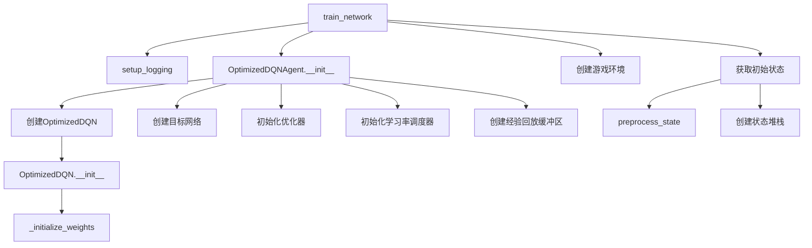
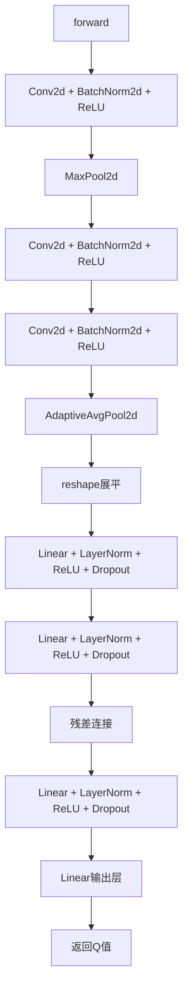
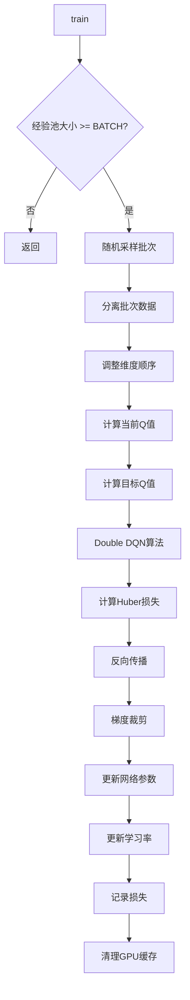
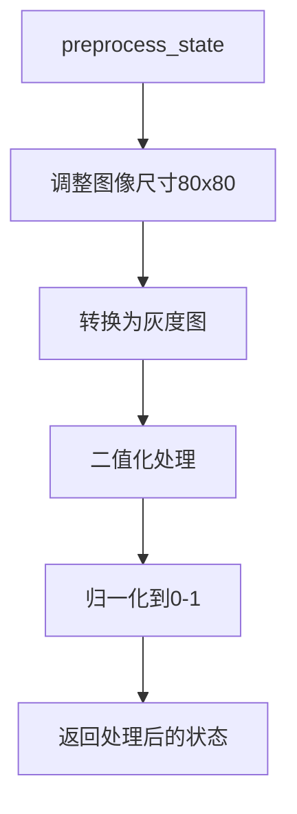
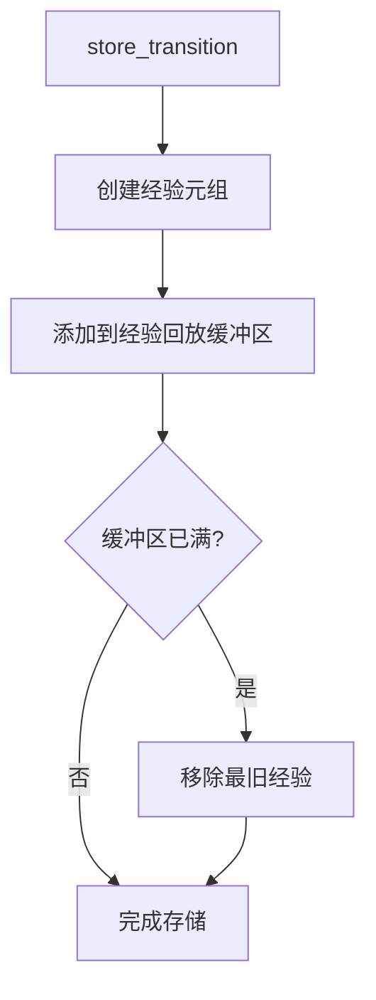

# 优化版DQN函数调用流程图

## 整体执行流程

```mermaid
graph TD
    A[开始训练] --> B[train_network()]
    B --> C[setup_logging()]
    B --> D[创建OptimizedDQNAgent]
    B --> E[创建游戏环境]
    B --> F[初始化状态]
    B --> G[进入训练循环]
    
    G --> H[获取状态tensor]
    H --> I[select_action()]
    I --> J{是否采取动作?}
    J -->|是| K[执行游戏动作]
    J -->|否| L[保持上一动作]
    
    K --> M[获得奖励和下一状态]
    L --> M
    M --> N[store_transition()]
    N --> O[更新状态]
    O --> P[训练网络]
    P --> Q[更新目标网络]
    Q --> R[更新探索率]
    R --> S{游戏结束?}
    S -->|否| H
    S -->|是| T[游戏重启]
    T --> H
```

## 详细函数调用关系

### 1. 初始化阶段



### 2. 动作选择流程

```mermaid
graph TD
    A[训练循环] --> B[get_state_tensor]
    B --> C[select_action]
    C --> D{epsilon > random()?}
    D -->|是| E[随机动作]
    D -->|否| F[q_network前向传播]
    F --> G[argmax选择动作]
    E --> H[返回动作索引]
    G --> H
```

### 3. 网络前向传播



### 4. 训练流程



### 5. 状态预处理流程



### 6. 经验存储流程



## 关键数据流

### 状态数据流
```
游戏图像 → preprocess_state → 状态堆栈 → get_state_tensor → 网络输入
```

### 动作数据流
```
网络输出 → select_action → 动作索引 → 游戏环境 → 奖励和下一状态
```

### 训练数据流
```
经验元组 → 经验回放 → 批次采样 → 网络训练 → 参数更新
```

## 时序关系

### 训练阶段时序
```
观察阶段 (OBSERVE=10步)
├── 纯随机动作
├── 收集经验
└── ε = 1.0

探索阶段 (EXPLORE=20步)
├── ε从1.0衰减到0.001
├── 开始网络训练
└── 平衡探索和利用

利用阶段
├── ε = 0.001
├── 主要依赖学习策略
└── 持续优化
```

### 动作执行时序
```
每FRAME_PER_ACTION帧 (3帧)
├── 第1帧：选择动作
├── 第2帧：保持动作
└── 第3帧：保持动作
```

## 关键函数职责

### OptimizedDQN类
- **__init__**: 定义网络架构
- **_initialize_weights**: 权重初始化
- **forward**: 前向传播计算

### OptimizedDQNAgent类
- **__init__**: 初始化智能体组件
- **preprocess_state**: 状态预处理
- **get_state_tensor**: 状态转换
- **select_action**: 动作选择策略
- **store_transition**: 经验存储
- **train**: 网络训练
- **update_target_network**: 目标网络更新
- **update_epsilon**: 探索率更新

### 主训练函数
- **train_network**: 协调整个训练过程
- **setup_logging**: 日志配置

## 错误处理流程

### 批归一化错误处理
```
检测到batch_size=1 → 使用LayerNorm替代BatchNorm1d → 确保任意批次大小正常工作
```

### GPU内存管理
```
训练后 → 清理GPU缓存 → 防止内存泄漏
```

### 经验池管理
```
经验池满 → 移除最旧经验 → 维护固定大小
```

这个函数调用流程图展示了优化版DQN的完整执行过程，从初始化到训练循环的每个关键步骤。 