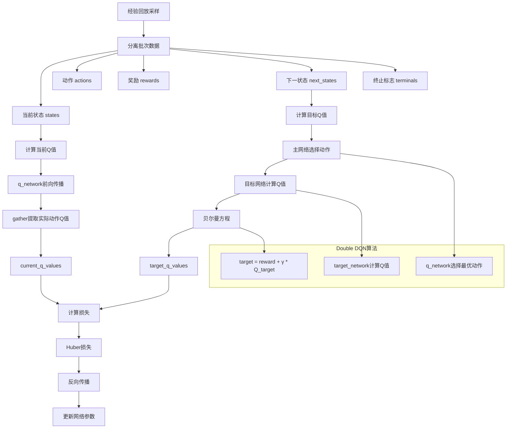
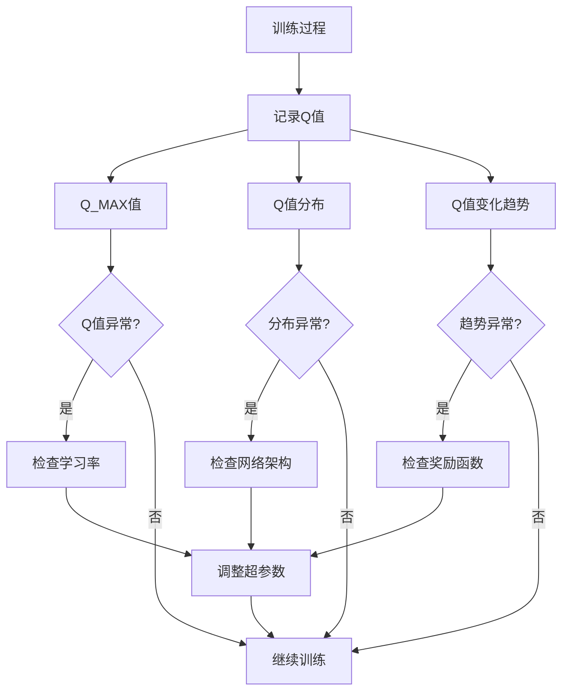
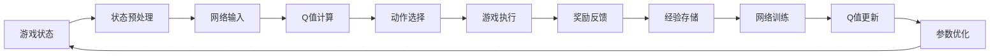

# Q值计算流程图

## 1. 推理时的Q值计算流程

```mermaid
graph TD
    A[游戏状态] --> B[状态预处理]
    B --> C[状态堆栈 4帧]
    C --> D[转换为Tensor]
    D --> E[网络前向传播]
    E --> F[卷积层处理]
    F --> G[全连接层处理]
    G --> H[输出层]
    H --> I[Q值输出 [Q0, Q1]]
    I --> J[argmax选择]
    J --> K[执行动作]
    
    subgraph "网络架构"
        F1[Conv2d + BatchNorm2d + ReLU]
        F2[MaxPool2d]
        F3[Conv2d + BatchNorm2d + ReLU]
        F4[Conv2d + BatchNorm2d + ReLU]
        F5[AdaptiveAvgPool2d]
        G1[Linear + LayerNorm + ReLU + Dropout]
        G2[Linear + LayerNorm + ReLU + Dropout]
        G3[残差连接]
        G4[Linear + LayerNorm + ReLU + Dropout]
        H1[Linear输出层]
    end
    
    F --> F1
    F1 --> F2
    F2 --> F3
    F3 --> F4
    F4 --> F5
    F5 --> G1
    G1 --> G2
    G2 --> G3
    G3 --> G4
    G4 --> H1
    H1 --> I
```

## 2. 训练时的Q值计算流程



## 3. 贝尔曼方程计算

```mermaid
graph LR
    A[即时奖励 r] --> D[目标Q值]
    B[折扣因子 γ = 0.99] --> E[下一状态最大Q值]
    C[非终止掩码 ~terminals] --> F[最终目标]
    
    D --> G[target_q_values]
    E --> G
    F --> G
    
    G --> H[Q(s,a) = r + γ * max Q(s',a')]
```

## 4. 网络维度变换

```mermaid
graph TD
    A[输入: batch_size, 4, 80, 80] --> B[卷积层1: 4→64]
    B --> C[batch_size, 64, 20, 20]
    C --> D[MaxPool2d]
    D --> E[batch_size, 64, 10, 10]
    E --> F[卷积层2: 64→128]
    F --> G[batch_size, 128, 10, 10]
    G --> H[卷积层3: 128→128]
    H --> I[batch_size, 128, 10, 10]
    I --> J[AdaptiveAvgPool2d]
    J --> K[batch_size, 128, 4, 4]
    K --> L[展平]
    L --> M[batch_size, 2048]
    M --> N[全连接层1: 2048→1024]
    N --> O[batch_size, 1024]
    O --> P[全连接层2: 1024→512]
    P --> Q[batch_size, 512]
    Q --> R[全连接层3: 512→256]
    R --> S[batch_size, 256]
    S --> T[输出层: 256→2]
    T --> U[batch_size, 2] - Q值
```

## 5. 动作选择决策树

```mermaid
graph TD
    A[当前状态] --> B{训练阶段?}
    B -->|观察阶段| C[随机动作 ε=1.0]
    B -->|探索/利用阶段| D{随机数 < ε?}
    D -->|是| E[随机动作]
    D -->|否| F[网络决策]
    
    F --> G[计算Q值]
    G --> H[argmax选择]
    H --> I[执行最优动作]
    
    C --> J[执行随机动作]
    E --> J
    
    subgraph "Q值计算"
        G1[网络前向传播]
        G2[输出 [Q(不拍翅膀), Q(拍翅膀)]]
        G3[选择 max(Q0, Q1)]
    end
    
    G --> G1
    G1 --> G2
    G2 --> G3
    G3 --> H
```

## 6. 损失计算流程

```mermaid
graph TD
    A[current_q_values] --> C[计算差异]
    B[target_q_values] --> C
    C --> D{差异绝对值 ≤ δ?}
    D -->|是| E[MSE损失]
    D -->|否| F[MAE损失]
    
    E --> G[L = 0.5 * (pred - target)²]
    F --> H[L = δ * |pred - target| - 0.5 * δ²]
    
    G --> I[Huber损失]
    H --> I
    I --> J[反向传播]
    J --> K[梯度更新]
```

## 7. 目标网络更新

```mermaid
graph TD
    A[主网络参数 θ] --> C[软更新]
    B[目标网络参数 θ'] --> C
    C --> D[θ' ← τθ + (1-τ)θ']
    D --> E[τ = 0.001]
    E --> F[更新目标网络]
    
    subgraph "更新过程"
        G[遍历所有参数]
        H[计算新参数值]
        I[复制到目标网络]
    end
    
    F --> G
    G --> H
    H --> I
```

## 8. 完整训练循环

```mermaid
graph TD
    A[游戏环境] --> B[获取状态]
    B --> C[选择动作]
    C --> D[执行动作]
    D --> E[获得奖励和下一状态]
    E --> F[存储经验]
    F --> G{经验池满?}
    G -->|否| B
    G -->|是| H[训练网络]
    
    H --> I[计算当前Q值]
    I --> J[计算目标Q值]
    J --> K[计算损失]
    K --> L[更新网络]
    L --> M[更新目标网络]
    M --> N[更新探索率]
    N --> O{游戏结束?}
    O -->|否| B
    O -->|是| P[游戏重启]
    P --> B
    
    subgraph "Q值计算核心"
        Q1[当前Q值: Q_network(states)]
        Q2[目标Q值: r + γ * Q_target(next_states)]
        Q3[损失: Huber(Q_current, Q_target)]
    end
    
    I --> Q1
    J --> Q2
    K --> Q3
```

## 9. Q值监控和调试



## 10. 关键数据流



这些流程图展示了Q值计算的完整过程，从输入处理到网络计算，再到训练更新，涵盖了DQN算法的所有关键步骤。 